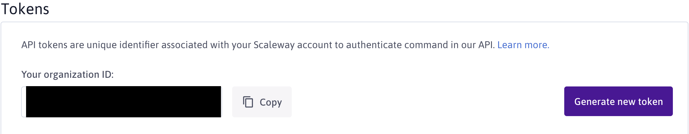
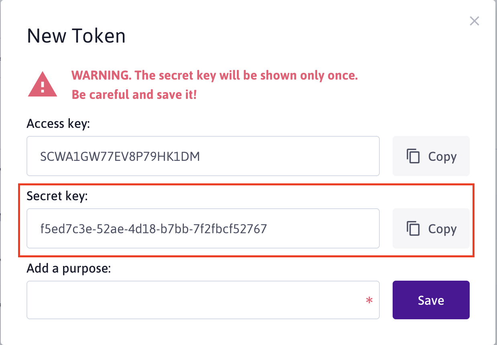

# Serverless Framework with Scaleway Functions

This is a guide on how to `get started` using Scaleway Functions with Serverless framework.

## Requirements

In order to start development on this plugin, you will have to run through multiple steps:
- Install node.js
- Install [Serverless](https://serverless.com) CLI
- Clone this repository locally

# Serverless Deploy - Deploy a FAAS Project

## Create a Project

**Make sure** that you cloned/downloaded this repository locally.

Some template examples are available [inside this plugin's examples directory](../examples) (More informations about available templates/examples [in this page of the documentation](./templates.md)), you may create a project boilerplate from one of these templates with the following command:

```
serverless create --template-path=path/to/plugin/directory --path=my-awesome-project
```

## Authenticate to Scaleway

Scaleway's Serverless plugin requires access to Scaleway resources for your account in order to properly manage spaces and functions.

### Retrieve Scaleway Credentials

You will need to provide both `organization ID` and `secret key`. You may retrieve these inside the [console's credentials page](https://console.scaleway.com/account/credentials):

- Login/Register to [Scaleway console](https://console.scaleway.com)
- Go to your [credentials management page](https://console.scaleway.com/account/credentials)
- Retrieve your `organization ID` and generate a token (see following picture):

- Retrieve lastly created token's `secret key`:


Now, when running `serverless` commands from your project directory, serverless CLI will use scaleway plugin to execute commands.

### Use your credentials

Now that your retrieved your `organization ID` and created a new `token`, you will have to use these credentiasl with the Serverless Framework.

There are multiple ways to do it:

- **serverless.yml manifest**. Inside your manifest, you may inquire your credentials with the following structure under the `provider` key:
```yml
provider:
  scwToken: <scw-token>
  scwOrganization: <scw-organization-id>
```
- **CLI arguments**:
```
serverless deploy --scw-token=<scw-token> --scw-organization=<scw-organization-id>
```
- **Environment variables**:
```
export SCW_TOKEN=<scw-token>
export SCW_ORGANIZATION=<scw-organization-id>
serverless deploy
```

The priority order is the following (from top: + priority to bottom: - priority):
- CLI
- Environment variables
- serverless.yml
- scwToken and scwOrganization variables

## Managing resources

You may want to update `serverless.yml manifest` file in order to manage functions your Scaleway Functions.

**Note** that in order to use Scaleway Functions plugin, you will need to use the following statement inside your `serverless.yml` file:
```yml
plugins:
  - serverless-scaleway-functions
```

### Managing Namespace (Project)

```yml
service:
  # Name of the namespace to manage on your Scaleway Account, basically your project name
  name: <namespace-name>

provider:
  name: scaleway
  # Available Runtimes are:
  # node8, node10 for JavaScript
  # python (2.7), python3 (3.7) for Python
  # golang
  runtime: <runtime>
  # See documentation below for environment
  env:
    test: test
  # See documentation in Credentials Section
  scwToken: <scw-token>
  scwOrganization: <scw-organization-id>
```

### Managing functions

```yml
functions:
  myFunction:
    # handler may vary for each runtimes (e.g in golang, references package while python/node references handler file).
    handler: path/to/handler/file
    # Environment only available in this function
    env:
      MY_VARIABLE: "my-value"
```

### Runtime and Functions Handler

You must specify your functions runtime inside `provider.runtime` key inside your serverless.yml file.

#### Runtimes

Available runtimes are:
- `node8` and `node10` for JavaScript
- `python` (2.7) and `python3` (3.7) for Python
- `golang`


#### Functions Handler

Based on the chosen runtime, the `handler` variable on function might vary:
- `node` (8 or 10): Path to your handler file (from serverless.yml), omit `./`, `../`.
```
- src
  - handlers
    - firstHandler.js
    - secondHandler.js
- serverless.yml
```
Inside serverless.yml:
```yml
provider:
  # ...
  runtime: node8 # or node10
functions:
  first:
    handler: src/handlers/firstHandler.js
  second:
    handler: src/handlers/secondHandler.js
```
- `python` (2.7 and 3.7): Similar to `node`, path to handler file `src/testing/handler.py`:
```
- src
  - handlers
    - firstHandler.py
    - secondHandler.py
- serverless.yml
```
Inside serverless.yml:
```yml
provider:
  # ...
  runtime: python3 # or python for python 2.7
functions:
  first:
    handler: src/handlers/firstHandler.py
  second:
    handler: src/handlers/secondHandler.py
```
- `golang`: Path to your handler's **package**, for example if I have the following structure:
```
- src
  - testing
    - handler.go -> package testing
  - second
    - handler.go -> package second
- serverless.yml
```
Your serverless.yml `functions` should look something like this:
```yml
provider:
  # ...
  runtime: golang
functions:
  testing:
    handler: src/testing
  second:
    handler: src/second
```

### Environment Variables

You may inject environment variables in different scope:
- `namespace`, environment variables will be mounted in every functions of the namespace
- `function`, environment variables will only be mounted to given function.

**Note** that variables written inside functions scope will override variables from namespace (if multiple variables with the same name are inquired in both namespace and function).

```yml
provider:
  # Global env -> mounted in every functions
  env:
    GLOBAL_VARIABLE: mounted-everywhere

functions:
  myFunction:
    handler: handler.js
    # Local env -> Only mounted inside function myFunction
    env:
      LOCAL_VARIABLE: mounted-in-this-function
```


# Serverless Remove: Delete a project

To remove a project, you may run the following command:

```bash
serverless remove
```

This will remove all your functions, as well as your Scaleway Functions namespace.

**Please Note** that your Scaleway Container Registry namespace will not be removed, you will have to delete it manually either via Scaleway console, or Scaleway container registry's API.